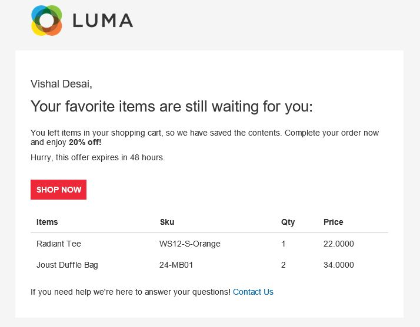
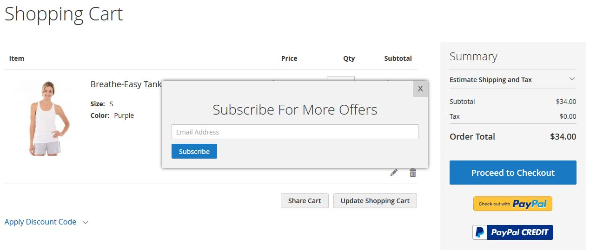
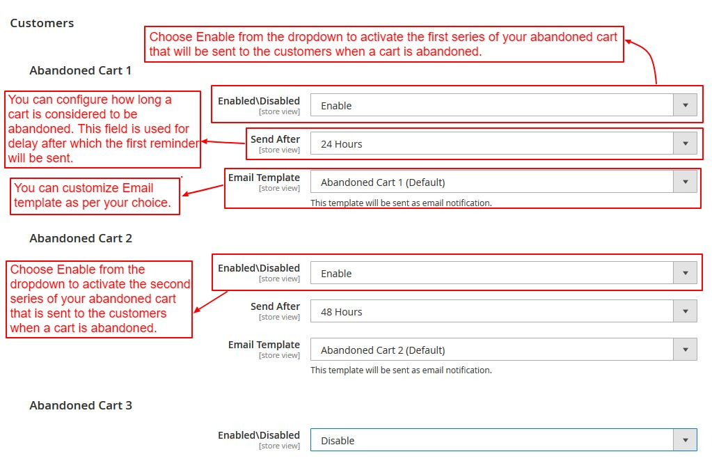

# M2Commerce: Magento 2 Abandoned Cart
## Description

There are times when customers happen to abandon their carts without any knowledge. Maybe due to shortage of time or some interruption while checking out, unable to handle a complicated checkout process and so more. Abandoned Cart Email extension allows store owners to convert visitors or guests into real customers. Send email reminders to bring customers back to the store to complete orders by giving lucrative offers.

### Features
1. Send automated triggered emails to customers who left your store without completing the checkout process 
2. Capture guest email address and send automated triggered emails to guests 
3. Customizable email templates for your follow-ups 
4. Customers can restore the abandoned cart with only one-click 
5. Configure the schedule of email sending 
6. Compatible with 2.3.x and 2.4.x versions.

### Screenshot




## Installation
### Magento® Marketplace

This extension will also be available on the Magento® Marketplace when approved.

1. Go to Magento® 2 root folder
2. Require/Download this extension:

   Enter following commands to install extension.

   ```
   composer require m2commerce/abandoned-cart"
   ```

   Wait while composer is updated.

   #### OR

   You can also download code from this repo under Magento® 2 following directory:

    ```
    app/code/M2Commerce/AbandonedCart
    ```    

3. Enter following commands to enable the module:

   ```
   php bin/magento module:enable M2Commerce_AbandonedCart
   php bin/magento setup:upgrade
   php bin/magento setup:di:compile
   php bin/magento cache:clean
   php bin/magento cache:flush
   ```

4. If Magento® is running in production mode, deploy static content:

   ```
   php bin/magento setup:static-content:deploy
   ```
